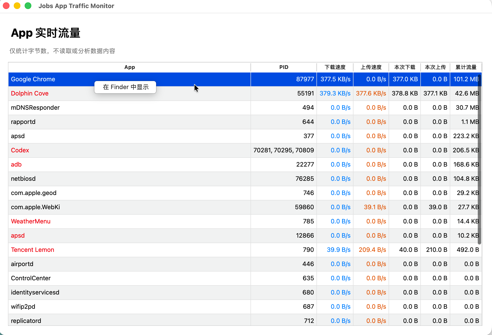

# `JobsAppTrafficMonitor`

[toc]

---

## 🔥 前言

JobsAppTrafficMonitor 是 macOS / Windows 按 App 实时统计上下行流量的桌面工具。程序只读取连接元数据与字节计数，不读取、解析或保存数据包内容。

## 一、当前能力

- macOS 使用系统自带 `nettop` 获取每个进程的累计接收/发送字节数。
- 自动计算采样字节数、实时上传/下载速度和累计流量。
- 将 App 内的 Helper / XPC 进程归并到所属 `.app`。
- 外源 App 名称标红，系统 App 与系统进程使用默认颜色。
- App 行支持右键“在 Finder 中显示”。
- 提供 [**PySide6**](https://doc.qt.io/qtforpython-6/) 桌面界面。
- Windows ETW 采集器接口已经预留。

## 二、双击入口

### 2.1、macOS 直接运行源码

进入 `scripts/【MacOS】▶️运行项目.command` 文件夹，双击同名 `.command` 文件。

脚本自动体检 [**Homebrew**](https://brew.sh/)、[**Python**](https://www.python.org/) 和 PySide6；缺少时自动安装，然后启动桌面界面。用户不需要手动创建虚拟环境或输入 Python 命令。

### 2.2、macOS 生成 DMG

进入 `scripts/【MacOS】📦生成DMG.command` 文件夹，双击同名 `.command` 文件。

脚本自动补齐构建环境，通过 [**PyInstaller**](https://pyinstaller.org/) 生成 `.app`，再封装为自包含 `.dmg`。构建结束后 Finder 自动定位安装包。

### 2.3、Windows 生成 EXE

把完整项目放到 Windows 电脑，进入 `scripts/【Windows】📦生成EXE.bat` 文件夹，双击同名 `.bat` 文件。

脚本自动检查 Python，创建内部构建环境并生成自包含 `.exe`。Windows 安装包必须在 Windows 上构建，macOS 不负责交叉生成 EXE。

## 三、成品运行环境

由构建脚本生成的 `.dmg/.exe` 已包含 Python、PySide6 和项目代码。普通用户运行成品时：

- 不需要安装 Homebrew。
- 不需要安装 Python。
- 不需要安装 PySide6。
- 不会修改用户的开发环境。

环境体检与自动安装只发生在源码启动或构建脚本中。

## 四、输出目录

| 平台 | 输出位置 |
| --- | --- |
| macOS App | `dist/JobsAppTrafficMonitor.app` |
| macOS DMG | `dist/JobsAppTrafficMonitor-版本号-macOS-架构.dmg` |
| Windows EXE | `dist/windows/JobsAppTrafficMonitor.exe` |

## 五、平台边界

- macOS 版本已经具备按 App 实时统计能力。
- Windows ETW 采集器仍处于接口阶段，当前 Windows 构建入口用于准备打包链路，不作为正式监控版本分发。
- VPN、代理进程可能隐藏内部转发流量的原始 App 身份。
- macOS 构建脚本只执行本机临时签名，没有 Apple Developer ID 和苹果公证。
- Windows EXE 没有代码签名，SmartScreen 可能提示未知发布者。

<a id="🔚" href="#前言" style="font-size:17px; color:green; font-weight:bold;">我是有底线的➤点我回到首页</a>
