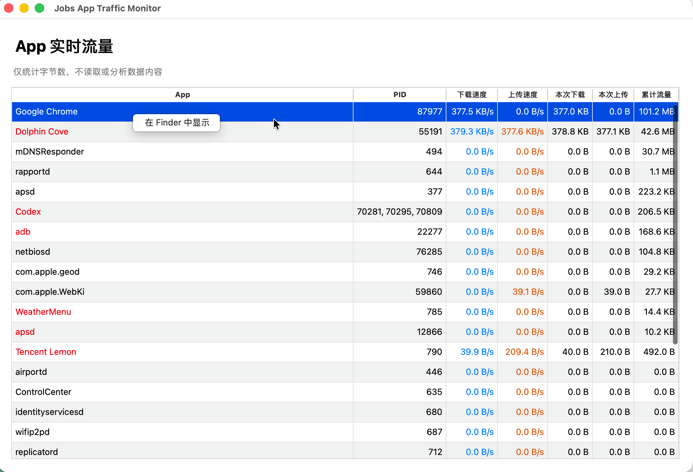

# `JobsAppTrafficMonitor`


[toc]

---

## 🔥 <font id=前言>前言</font>

JobsAppTrafficMonitor 是 macOS / Windows 按 App 实时统计上下行流量的桌面工具。程序只读取连接元数据与字节计数，不读取、解析或保存数据包内容。



## 一、目录结构 <a href="#前言" style="font-size:17px; color:green;"><b>🔼</b></a> <a href="#🔚" style="font-size:17px; color:green;"><b>🔽</b></a>

```text
.
├── README.md
├── 【MacOS】📦生成dmg.command
├── 【Windows】📦生成exe.bat
└── JobsAppTrafficMonitor/
    ├── pyproject.toml
    ├── icon.png
    ├── assets/
    ├── scripts/
    │   └── _shared/
    ├── src/
    │   └── jobs_app_traffic_monitor/
    └── tests/
```

- `./README.md`：外层总说明，统一解释 Python 工程、macOS 入口和 Windows 入口。
- `./【MacOS】📦生成dmg.command`：macOS 打包入口，双击后生成 `.app` 和 `.dmg`。
- `./【Windows】📦生成exe.bat`：Windows 打包入口，在 Windows 本机生成 `.exe`。
- `./JobsAppTrafficMonitor/`：内层 Python 工程目录，保存源码、测试、配置、资源和构建辅助脚本。

外层 `.bat` / `.command` 不再使用同名文件夹包裹，也不再分别放独立 `README.md`；入口说明统一收口在本文件。

## 二、当前能力 <a href="#前言" style="font-size:17px; color:green;"><b>🔼</b></a> <a href="#🔚" style="font-size:17px; color:green;"><b>🔽</b></a>

- macOS 使用系统自带 `nettop` 获取每个进程的累计接收/发送字节数。
- 自动计算采样字节数、实时上传/下载速度和累计流量。
- 将 App 内的 Helper / XPC 进程归并到所属 `.app`。
- 外源 App 名称标红，系统 App 与系统进程使用默认颜色。
- App 行支持右键“在 Finder 中显示”。
- 提供 [**PySide6**](https://doc.qt.io/qtforpython-6/) 桌面界面。
- macOS 点击黄色最小化按钮后隐藏主窗口并驻留系统顶部菜单栏；点击图标可恢复，菜单可退出并停止采集器。
- Windows ETW 采集器接口已经预留。

## 三、打包入口 <a href="#前言" style="font-size:17px; color:green;"><b>🔼</b></a> <a href="#🔚" style="font-size:17px; color:green;"><b>🔽</b></a>

JobsAppTrafficMonitor 不提供外层源码运行入口；用户运行程序时，应先通过对应平台脚本生成 `.dmg` 或 `.exe`，再从打包产物启动。

### 3.1、macOS 生成 DMG

双击外层脚本：

```text
./【MacOS】📦生成dmg.command
```

脚本自动补齐构建环境，通过 [**PyInstaller**](https://pyinstaller.org/) 生成 `.app`，再封装为自包含 `.dmg`。构建结束后 Finder 自动定位安装包。脚本执行本机临时签名，不包含 Apple Developer ID 和苹果公证。

运行前脚本会打印内置自述并等待回车确认；确认前不会安装依赖或生成构建产物。日志写入系统临时目录中的 `【MacOS】📦生成dmg.log`。

### 3.2、Windows 生成 EXE

把完整项目放到 Windows 电脑，双击外层脚本：

```text
./【Windows】📦生成exe.bat
```

脚本自动检查 Python，创建内部构建环境并生成自包含 `.exe`。Windows 安装包必须在 Windows 上构建，macOS 不负责交叉生成 EXE。

Windows 脚本会暂停展示内置说明，继续后可能通过 `winget` 安装 Python，并从 PyPI 下载 PySide6 与 PyInstaller。未进行 Windows 代码签名，SmartScreen 可能提示未知发布者。

## 四、成品运行环境 <a href="#前言" style="font-size:17px; color:green;"><b>🔼</b></a> <a href="#🔚" style="font-size:17px; color:green;"><b>🔽</b></a>

由构建脚本生成的 `.dmg/.exe` 已包含 Python、PySide6 和项目代码。普通用户运行成品时：

- 不需要安装 Homebrew。
- 不需要安装 Python。
- 不需要安装 PySide6。
- 不会修改用户的开发环境。

环境体检与自动安装只发生在构建脚本中。

## 五、输出目录 <a href="#前言" style="font-size:17px; color:green;"><b>🔼</b></a> <a href="#🔚" style="font-size:17px; color:green;"><b>🔽</b></a>

| 平台 | 输出位置 |
| --- | --- |
| macOS App | `./JobsAppTrafficMonitor/dist/JobsAppTrafficMonitor.app` |
| macOS DMG | `./JobsAppTrafficMonitor/dist/JobsAppTrafficMonitor-版本号-macOS-架构.dmg` |
| Windows EXE | `./JobsAppTrafficMonitor/dist/windows/JobsAppTrafficMonitor.exe` |

## 六、平台边界 <a href="#前言" style="font-size:17px; color:green;"><b>🔼</b></a> <a href="#🔚" style="font-size:17px; color:green;"><b>🔽</b></a>

- macOS 版本已经具备按 App 实时统计能力。
- Windows ETW 采集器仍处于接口阶段，当前 Windows 构建入口用于准备打包链路，不作为正式监控版本分发。
- VPN、代理进程可能隐藏内部转发流量的原始 App 身份。
- macOS 构建脚本只执行本机临时签名，没有 Apple Developer ID 和苹果公证。
- Windows EXE 没有代码签名，SmartScreen 可能提示未知发布者。

<a id="🔚" href="#前言" style="font-size:17px; color:green; font-weight:bold;">我是有底线的➤点我回到首页</a>
